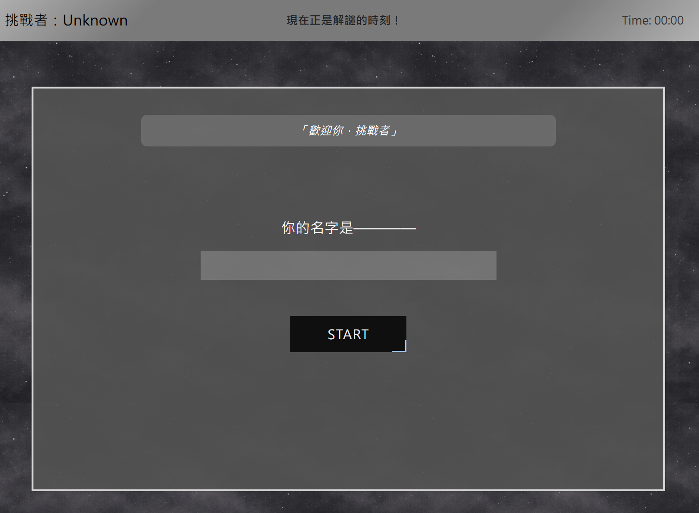
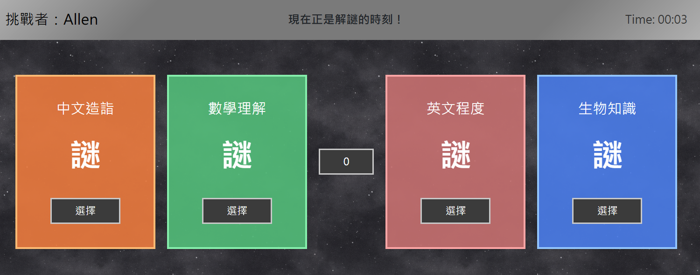
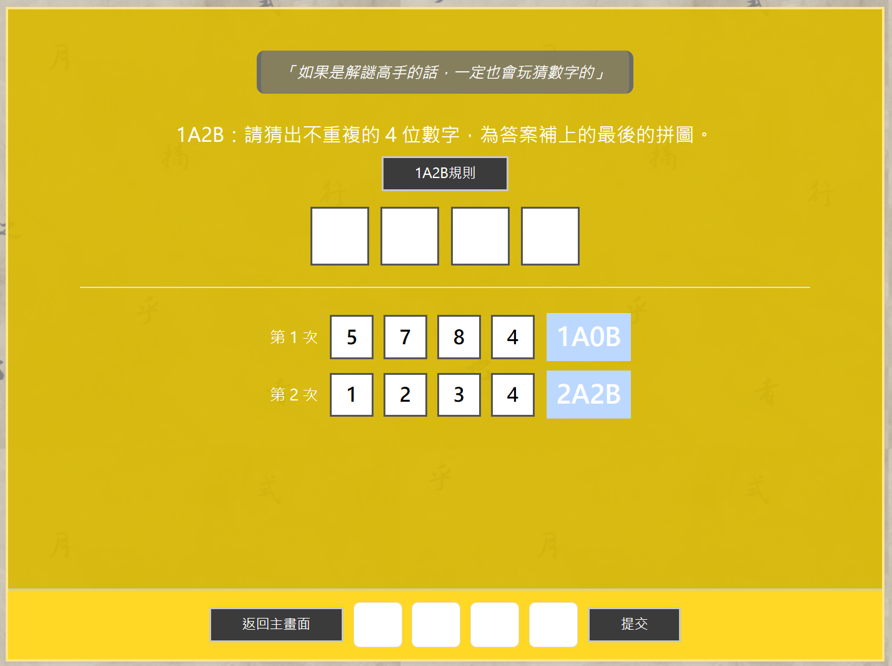

# React Game

A browser-based puzzle game built with React.  
Players must complete four different puzzle challenges to unlock the final question.

## Live Demo

Play the game here:  
https://sakuraness.github.io/react-game/

---

## Screenshots

### Start Page


### Home Page


### 1A2B Example


---

## Gameplay

1. Enter your name.
2. Four puzzle challenges are available.
3. Players can enter any puzzle in any order.
4. After completing all puzzles, the final challenge & hint question is unlocked.
5. Solve the final challenge to finish the game.

Puzzle types include:

- Logic puzzle
- Pattern recognition
- Math challenge
- Hidden clue puzzle

---

## Tech Stack

- **React**
- **JavaScript (ES6)**
- **CSS**
- **GitHub Pages** for deployment

---

## Run Locally

1. Clone the repository:

 ```git clone https://github.com/sakuraness/react-game.git```

2. Install dependencies:

```npm install```

3. Start the development server:

```npm start```
